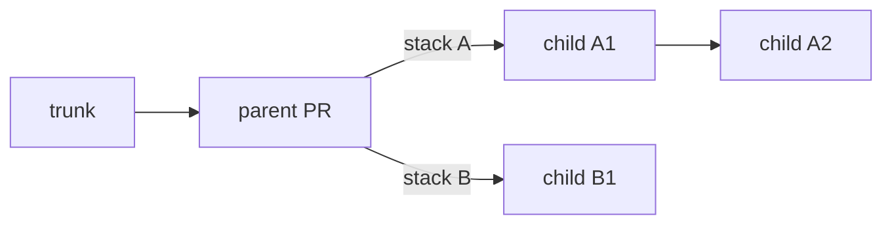

## See every stack

Use `jj-stack list` to find the stacks you have submitted from this repo:

```console
jj-stack list
```

Copy a stack's head change ID from the output to work with it from any working-copy change:

```console
jj-stack view <head-change-id>
jj-stack submit <head-change-id>
```

`jj-stack list` includes stacks with saved pull request links. To see work you have not submitted
yet, use `jj` directly. This shows all mutable changes and their immediate immutable parents:

```console
jj log -r 'mutable() | (parents(mutable()) & immutable())'
```

## Start a dependent stack

When new work depends on an existing stack but needs its own GitHub stack, use `--base` to name
the parent change it builds on. Submit the parent first, then submit the child stack:

```console
jj-stack submit --base <parent-change-id> <child-head-change-id>
```

Only changes after the parent, up to the child head, are submitted. The parent's PR must be open
and still match its submitted commit. `--base` applies to one command, so repeat it whenever you
update the child stack. Omitting it includes the parent changes in the submission.



Merge the parent before merging the child stack. Once the change named by `--base` has merged,
sync the parent stack. Then rebase the child changes onto trunk and submit them without `--base`:

```console
jj rebase -r '<child-bottom-change-id>::<child-head-change-id>' -o 'trunk()'
jj-stack submit <child-head-change-id>
```

Select only the child's changes for this rebase, even if more work remains in the parent stack.

## Combine independent stacks locally

To test independent stacks together, create a local *megamerge*: an empty jj merge change whose
parents are the stack heads. This lets you work with both stacks without making either depend on
the other.

Work and test above the megamerge, but submit and merge each underlying stack separately. Keep
the megamerge local; jj-stack accepts only linear stacks. For a walkthrough, see Isaac Corbrey's
[Jujutsu megamerges for fun and profit][megamerges].

[megamerges]: https://isaaccorbrey.com/notes/jujutsu-megamerges-for-fun-and-profit

If code in one stack really does depend on another, use a dependent stack instead.

## Look at several of your stacks at once

`jj-stack view` can inspect several stacks in one run:

```console
jj-stack view first-head --pull-request 42 second-head
```

`jj-stack submit` and `jj-stack merge` act on one selected stack. To apply completed merges
across the repo, use [`jj-stack sync --all`](merge-and-sync.md#several-merged-stacks).

## Move work between stacks

After moving a change with `jj`, submit its original stack first, then its new stack. The change
keeps its pull request. The first submit removes that PR from its old GitHub stack; the second
updates its base and adds it to the new stack. If you try the opposite order, jj-stack stops and
asks you to submit the original stack first.
