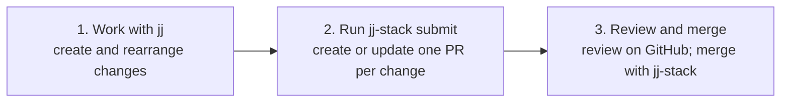
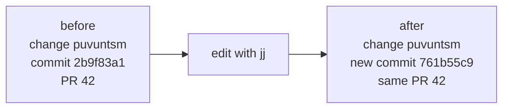

Create and rearrange your changes with `jj`, then run `jj-stack submit` to bring their pull
requests up to date on GitHub. Each change becomes one PR, and the local parent order determines
the PR order.

## The whole workflow

### Local work

Use familiar `jj` commands to create, split, squash, reorder, rebase, or abandon your changes.
Their order determines the order of your pull requests on GitHub.

### Each of your changes becomes one pull request

The stack runs from the selected top change back to trunk. Each change must have one parent,
a description, and a non-empty diff. Two or more changes produce a GitHub stack; a single change
produces an ordinary pull request.

The bottom PR targets trunk. Each PR above it targets the PR branch below, so its diff shows
only that change. Select a stack by its top change when working on
[multiple stacks](guides/multiple-stacks.md).

### Review on GitHub, merge with jj-stack

Use GitHub for comments, approvals, and checks. `jj-stack merge` merges the ready PRs from the
bottom upward, respecting the repo's rules and merge queue. If GitHub completes the merge
immediately, the command also updates your local stack. After a queued merge finishes, or if you
merge on GitHub, run `jj-stack sync`. See [merge and sync](guides/merge-and-sync.md).

## Editing a change keeps its pull request

`jj-stack` follows each change ID across rewrites. Editing or reordering a change updates its
existing PR on the next submit, even though the commit ID has changed.

In this example, the existing comments and review history stay on PR 42 even though the Git
commit ID has changed.

## You do not manage PR branches

GitHub requires a branch for every pull request. `jj-stack` creates and updates these PR branches
for you; their names stay stable across edits. `jj-stack doctor --fix` configures your repo to
keep them out of ordinary fetches and local bookmark output.

## When jj-stack is unsure, it stops

`jj-stack` saves the link between each local change and its PR. Before updating a PR, it checks
that the saved link still matches GitHub. If the match is ambiguous or a PR branch has changed
unexpectedly, the command stops with guidance. See [troubleshooting](troubleshooting.md) for
recovery steps.
