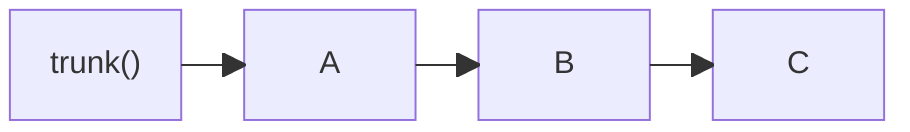
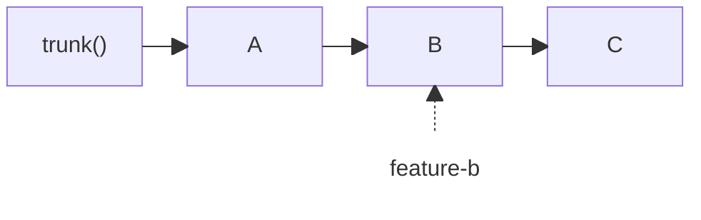

In `jj`, a bookmark is a movable name for a revision that can also become a Git branch when you
push it. `jj-stack` does not need a bookmark for every change, or even one bookmark for an entire
stack. It finds stacks from the parent relationships already recorded by `jj`.

## How jj-stack finds a stack

Suppose your local history looks like this:



If `C` is selected as the head, `jj-stack` walks back through its parents until it reaches
`trunk()`. The stack contains `A`, `B`, and `C`; the change at `trunk()` is the base and is not
part of the stack.

The main stack commands (`view`, `submit`, `merge`, and `sync`) select your current stack by
default. To select a different stack, pass its head change ID:

```console
jj-stack view <head-change-id>
jj-stack submit <head-change-id>
```

`jj-stack list` shows the head change ID of each tracked stack. A change ID continues to identify
the same logical change after you edit or rebase it, even though its Git commit ID changes.

## A bookmark does not divide a stack

Now suppose the bookmark `feature-b` points to `B`:



Selecting `C` still gives `jj-stack` the complete `A`, `B`, `C` stack. The bookmark does not
divide the stack, name it, or change which pull request belongs to any change. Ordinary
bookmarks continue to serve whatever purpose they have in your usual `jj` workflow.

A bookmark *does* matter when you pass it to a command:

```console
jj-stack view feature-b
jj-stack submit feature-b
```

A bookmark name is a valid `jj` revision expression. In these commands it selects the exact
change at `B` as the head, so the selected stack contains `A` and `B`, but not `C`. The bookmark
is therefore ignored as stack structure, but it is not ignored when you use it as a command
argument.

## `view` can find the stack containing a change

`view` gives a bare change ID one useful extra behavior. If you pass the change ID of `B`, it
looks for the complete stack containing that change. In the example above:

```console
jj-stack view <B-change-id>
```

shows `A`, `B`, and `C`, while:

```console
jj-stack view feature-b
```

shows only `A` and `B` because the bookmark selects `B` as the exact head.

If two visible stack heads descend from `B`, there clearly won't be a single containing stack.
In such a case, `view` will stop and ask for a more precise selection. You can pass the change
ID of your intended head, or pass a bookmark or other revision expression that resolves to that
exact head.

If you're going to run a command that can change a pull request, prefer to specify it using the
head change ID. Selecting a middle change or bookmark will choose only the lower part of a
stack, and `jj-stack` may stop if updating that part alone would disagree with the stack on
GitHub.

## PR branches are separate from your bookmarks

GitHub requires every pull request to have a Git branch. `jj-stack` creates and updates these PR
branches itself, normally with names beginning with `jj-stack/`. It uses Git refs directly,
rather than `jj` bookmarks. It will not reuse an ordinary bookmark that happens to point to the
same change.

The managed PR branches normally stay out of local bookmark output. Do not create, move, or
delete bookmarks in the `jj-stack/` namespace yourself. See
[Configuration](configuration.md#pr-branch-names) if you need to choose a different namespace
before your first submit.

## When a bookmark makes a change immutable

`jj-stack` submits visible, mutable `jj` changes. An ordinary local bookmark does not make its
target immutable. By default, `jj` uses `trunk()`, tags, and untracked remote bookmarks as
immutable heads, which makes those commits and their ancestors immutable. If you've customized
your own `immutable_heads()` configuration, `jj-stack` will use that.

The immutable change at `trunk()` is expected because it is the stack's base, not a change being
submitted. `jj-stack` does not allow other immutable changes inside a stack. For example, an
untracked remote bookmark pointing to a stack change can make that change immutable under `jj`'s
default configuration. If this happens, `jj-stack` stops instead of submitting or rewriting the
change.

Use `jj bookmark list --all-remotes` to see whether a remote bookmark points to the change. If
so, handle that bookmark through your normal `jj` workflow. For example, track it if it is a
branch you intend to work on, or move your mutable changes onto the intended base with `jj`.

`jj-stack` makes an exception for a fetched `jj-stack/` branch, so one can coexist with your
local change instead of freezing it. The exception covers a branch that exactly matches the
submitted version of a pull request `jj-stack` already tracks, and any other `jj-stack/` branch
whose change has just one visible commit. A branch pointing at a change with several visible
commits stays immutable, so a rewrite fetched from GitHub is never mistaken for your own copy —
and so does a commit that some other remote bookmark also points at, which is why the stop above
can still happen. `jj bookmark list --all-remotes` shows you which bookmark it is.

## Practical rules

- You do not need to create bookmarks for `jj-stack`.
- A bookmark attached to a stack member does not change the stack.
- A bookmark passed to a command selects its target as the exact stack head.
- Use the head change ID when you want to select the same complete stack again later.
- Leave the `jj-stack/` branch namespace to `jj-stack`.
